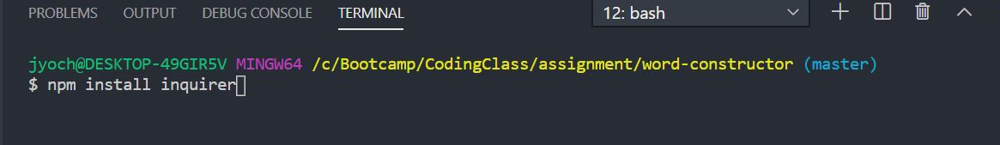
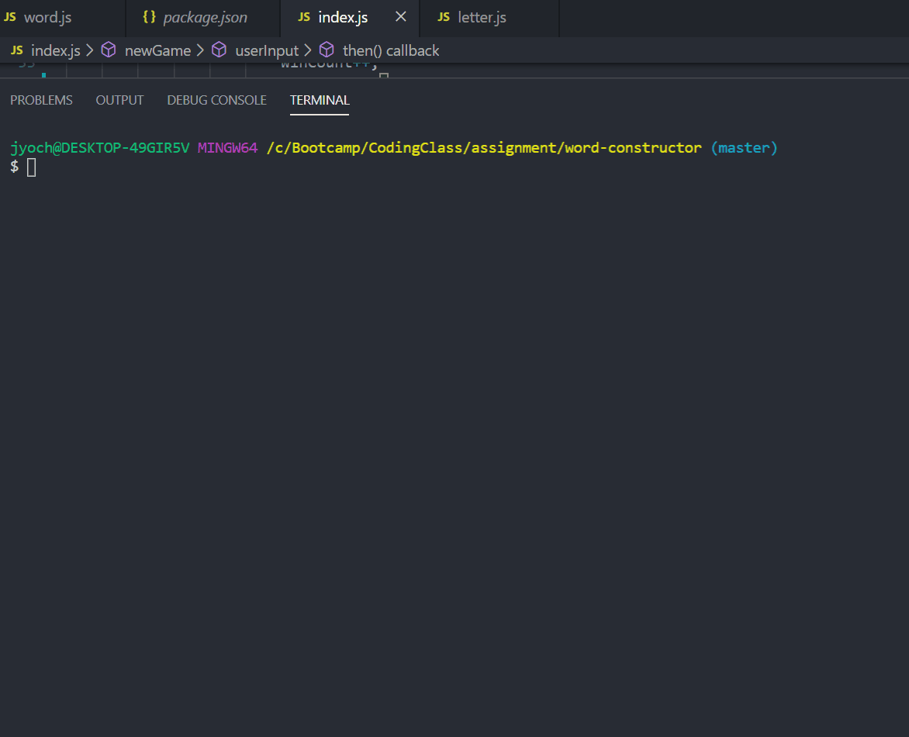

## Constructor Word Guess
## Overview
This is a word guess game using constructor and run solely in the console.

## Installation & Prerequisties
The constructor-word-guess is dependent upon Inquirer packages.

This packages can be installes using npm install command

## Instructions
The Constructor word guess application is opened with the following command: node index.js

To play the game enter a lowercase letter and press enter. If letter is correct, the underscore will change to the letter you have guesses.

If you guess all the correct letters, you will score a win and next word will be given

If you guess incorrect pint will be deducted from your guesses remaing .

If you run out of guesses , you will be given a new word 

## Built with

The constructor word guess application was built using node.js and following node package:
1. Inquirer